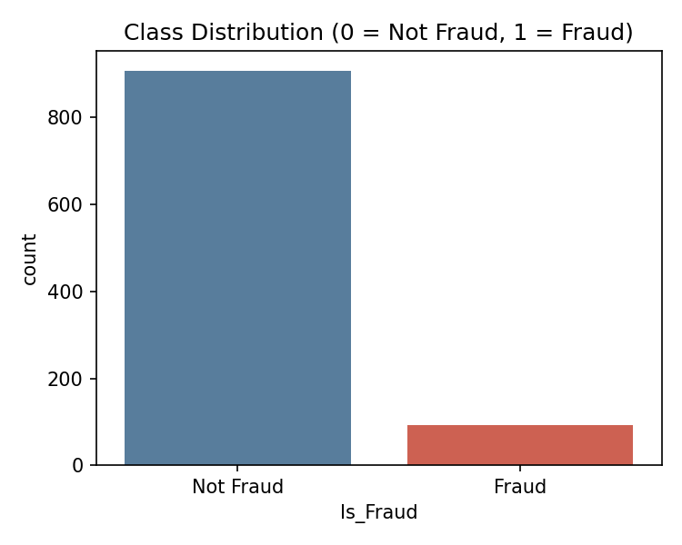
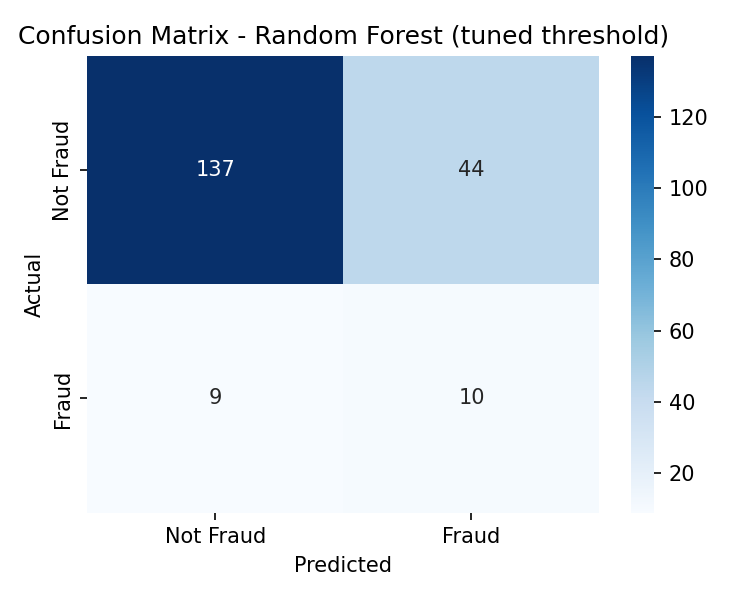

# Credit Card Fraud Detection

A machine learning pipeline that flags fraudulent credit card transactions in a
highly imbalanced dataset (~9.3% fraud), using SMOTE to correct class
imbalance and a Random Forest classifier with a recall-tuned decision
threshold to minimize missed fraud.

**[Live demo / project site →](#)** &nbsp;·&nbsp; built as a hands-on
exploration of the end-to-end fraud detection workflow: data prep, class
imbalance handling, model comparison, evaluation, and the trade-offs that
come with deploying this kind of system in the real world.

---

## Results

| Model | Accuracy | Precision | Recall | F1 | ROC-AUC |
|---|---|---|---|---|---|
| Logistic Regression | 70.5% | 0.167 | 0.526 | 0.253 | 0.697 |
| Random Forest (default threshold) | 81.0% | 0.194 | 0.316 | 0.240 | 0.704 |
| **Random Forest (tuned threshold = 0.38)** | **73.5%** | **0.185** | **0.526** | **0.274** | 0.704 |

Lowering the decision threshold from the default 0.5 to 0.38 nearly **doubles
recall on the fraud class (0.32 → 0.53)** at the cost of some accuracy — a
deliberate trade-off, since a missed fraud (false negative) is far more
costly than a false alarm.

<p align="center">
  
  
</p>

See [`outputs/metrics.json`](outputs/metrics.json) for full classification
reports and [`outputs/plots/`](outputs/plots/) for ROC curves and feature
importance.

---

## Why this is hard

With only 1,000 labeled transactions and 9.3% fraud prevalence, and no
behavioral, device, or location signals in the feature set, this is a
deliberately realistic — and deliberately difficult — version of the fraud
detection problem. See [Limitations](#limitations) below.

## Dataset

| Feature | Description |
|---|---|
| `Transaction_Amount` | Transaction value; unusually high amounts can indicate fraud |
| `Transaction_Type` | Encoded channel/category (some types are more fraud-prone) |
| `Time_Since_Last` | Minutes since the account's last transaction; rapid succession is suspicious |
| `Account_Age` | Account age in days; newer accounts are more vulnerable |
| `Transactions_Last_24h` | Transaction count in the trailing 24h; bursts of activity can be abnormal |
| `Is_Fraud` | Target: 1 = fraud, 0 = legitimate |

The dataset is synthetically generated (`data/generate_synthetic_data.py`) to
match the schema, size, and class balance (907 / 93) of the original project
dataset, since the source data can't be redistributed. Swap in your own CSV
with the same columns to reproduce results on real data.

## Pipeline

1. **Data cleaning** — null checks, dtype consistency
2. **Feature scaling** — `StandardScaler` on `Transaction_Amount`
3. **Train/test split** — 80/20, stratified
4. **Class imbalance handling** — SMOTE oversampling on the training set only
5. **Model training** — Logistic Regression (baseline) and Random Forest
6. **Threshold tuning** — sweep decision thresholds to maximize F1 while
   prioritizing recall on the fraud class
7. **Evaluation** — accuracy, precision, recall, F1, ROC-AUC, confusion matrix

## Project structure

```
credit-card-fraud-detection/
├── data/
│   ├── generate_synthetic_data.py   # builds the synthetic dataset
│   └── transactions.csv             # generated dataset (1000 rows)
├── src/
│   ├── preprocessing.py             # cleaning, scaling, split, SMOTE
│   ├── train_model.py               # trains, evaluates, tunes threshold, saves models
│   └── predict.py                   # score a single transaction via CLI
├── models/                          # saved model + scaler (.pkl)
├── outputs/
│   ├── metrics.json                 # full evaluation results
│   └── plots/                       # confusion matrices, ROC, feature importance
├── docs/                            # static project website (GitHub Pages)
├── requirements.txt
└── README.md
```

## Getting started

```bash
git clone https://github.com/<your-username>/credit-card-fraud-detection.git
cd credit-card-fraud-detection
pip install -r requirements.txt

# 1. Generate the dataset
python data/generate_synthetic_data.py --out data/transactions.csv

# 2. Train + evaluate both models, save plots and model artifacts
cd src
python train_model.py --data ../data/transactions.csv --outdir ../outputs --modeldir ../models

# 3. Score a single transaction
python predict.py --amount 2500 --type 3 --time-since-last 40 \
    --account-age 12 --tx-last-24h 15
```

## Why Random Forest

Random Forest was chosen over Logistic Regression, KNN, SVM, a single
Decision Tree, and neural networks because it handles nonlinear feature
interactions, is comparatively robust to overfitting via ensembling, needs
little tuning, and gives interpretable feature importances — a good fit for
a small, tabular, mixed-signal dataset like this one. Full comparison in
[`docs/index.html`](docs/index.html#why-not-others) / the project site.

## Limitations

- **Small, imbalanced dataset** — even with SMOTE, synthetic oversampling
  can't fully substitute for more real fraud examples.
- **Shallow feature set** — no device fingerprint, geolocation, or user
  history, which real fraud systems rely on heavily.
- **Black-box model** — Random Forest is accurate but not easily explainable
  per-decision; SHAP/LIME would help here.
- **Static training** — the model doesn't adapt automatically as fraud
  patterns evolve; it would need periodic retraining or online learning in
  production.

## Future work

- Real-time scoring on streaming transactions
- Additional behavioral/contextual features (device, geo, login history)
- Model explainability via SHAP or LIME
- Continuous/online learning as new transactions arrive
- XGBoost / gradient boosting comparison

## License

[MIT](LICENSE)
